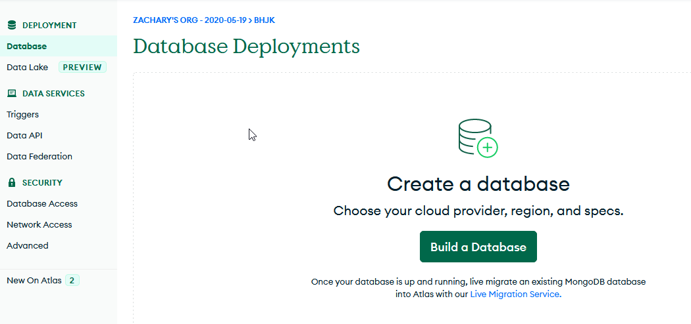
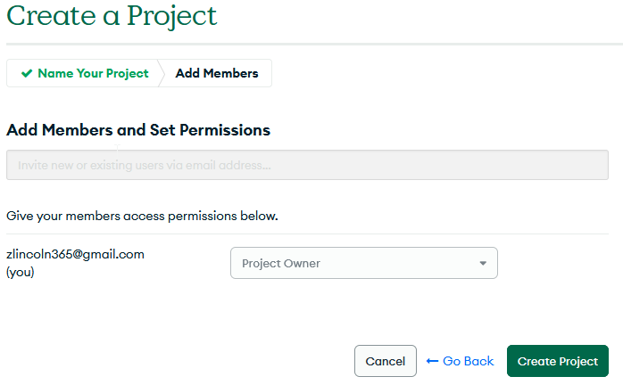

<h1 align="center">
   
  
   
  Print Jobs
   
</h1>

<h4 align="center", id="desc">A 3D printer automation solution for high production print farms.</h4>

  <a href="#key-features">Key Features</a> •
  <a href="#">Server Setup</a> •
  <a href="#">Printer Setup</a> •
  <a href="#">Client Setup</a> •
  <a href="#license">License</a>

## Key Features

* GUI Application for ease of use
* Cross-platform
  - Windows, macOS and Linux ready
* Lights out operation for 3d print farms
* Increase print production
* 24hr operation
* Easy to use
* Cheaper than other alternatives
* Distributed print jobs
* Print job balancing

## GUI

## Database Setup

How to set up the database

Step 0: Create an account and login to [MongoDB](https://www.mongodb.com/)

Step 1: Click "New Project"

Step 2: Enter the project name. This can be anything.

Step 3: Click "Build a Database"

Step 4: Click "Create Project"

Step 5: Click "Create". Make sure you select the free forever plan as shown

Step 6: Click "Create Cluster"

Step 7: Create an admin username and password. You will need this for later.

Step 8: Click "Add My Current IP Address" to add your current IP address to the allowed Address list.

Step 9: Click "Go to Database"

Step 10: Wait for the cluster to be created.

Step 11: Click "Browse Collections"

Step 12: Click "Add My Own Data"

Step 13: Enter "data" for the Database name and "jobs" for the collection name and click "Create"

Step 14: Click the plus icon over the database name "data"

Step 15: Enter "printers" in the collection name and click "Create".

Congratulations you have finished the database set up!

## Server Setup

Please follow the following instructions to set up [Remote Python](https://github.com/ZacharyLincoln/RemotePython) on your server and client.

[Remote Python - Server Setup](https://github.com/ZacharyLincoln/RemotePython#how-to-set-up-remote-python-server)

[Remote Python - Client Setup](https://github.com/ZacharyLincoln/RemotePython#run-any-python-script-with-external-requirements)

## Printer Setup

How to setup a printer

### Printer setup that has been tested and working

[Ender 3 V2](https://www.creality3dofficial.com/products/ender-3-v2-3d-printer)

This is the 3D printer that this project was tested on... any printer with a heated bed should work.

[CR Touch](https://www.amazon.com/dp/B09DVYZSYJ?psc=1&ref=ppx_yo2ov_dt_b_product_details)

The CR Touch ensures that the bed is level and that the print is constantly a certain distance away from the bed allowing it to delaminates from the bed when it cools.

[Spring Steel Build Plate](https://www.amazon.com/dp/B088841XH9?ref=ppx_yo2ov_dt_b_product_details&th=1)

Allows for adhesion while the build plate is heated and delaminates when the build plate is cool.

[Octoprint](https://octoprint.org/)

Allows for the printer to be controlled remotely by this program.

### All you need to set up a printer for automation is to download and setup octoprint on the printer.

In order to download and setup octoprint follow directions on [octoprint.org](https://octoprint.org/download/) to download and setup octoprint.

## Client Setup

### Add printer

How to add a printer

Step 1: Click "Add Printer"

Step 2: Add the ip, octoprint api key nozzle size and color of filament that is on the printer.

Step 3: Click "Create printer"

Step 4: Click "Refresh" on the bottom right to reload the printers.

### Remove printer

How to remove a printer

Step 1: Click Highlight the printer you want to delete.

Step 2: Click "Remove Printer"

Step 3: Click "Refresh" on the bottom right to reload the printers.

### Remove print script

### Add print job

How to Add a print job

Step 1: Click on the file you wish to print

Step 2: Enter the quantity you wish to print

Step 3: Select the color you want the print to be printed in, and the correct nozzle size for the file.

Step 4: Click "Add --->"

### Remove print job

How to Remove a print job

Step 1: Click the job you wish to remove

Step 2: Click "<--- Remove"

## License

MIT

---
> [zlincoln.dev](https://www.zlincoln.dev) &nbsp;&middot;&nbsp;
> GitHub [@ZacharyLincoln](https://github.com/ZacharyLincoln)

